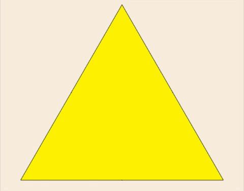

# Sierpinski Triangle
🔺 A JavaScript/HTML5 animated version of Sierpinski triangle using HTML5 canvas.
## About this version
- **Author :** [Oussama Ben Khiroun](https://oussamabenkhiroun.com/)
- **Language :** JavaScript animation using HTML5 canvas (credits to [Jörn Hameister](https://www.hameister.org/HTML5_Sierpinski.html))
- **Algorithm :** Use of recursive triangles tracing
- **Design :** HTML5 canvas
- **Source Code :** [https://github.com/oussbenk/sierpinski-triangle](https://github.com/oussbenk/sierpinski-triangle)
- **Demo :** [https://oussbenk.github.io/sierpinski-triangle/](https://oussbenk.github.io/sierpinski-triangle/)

> 

## About Sierpinski Triangle
The [Sierpinski](https://en.wikipedia.org/wiki/Sierpinski_triangle) triangle is a fractal and attractive fixed set with the overall shape of an equilateral triangle, subdivided recursively into smaller equilateral triangles. Originally constructed as a curve, this is one of the basic examples of self-similar sets, i.e., it is a mathematically generated pattern that is reproducible at any magnification or reduction [[Wikipedia]](https://en.wikipedia.org/wiki/Sierpinski_triangle).
